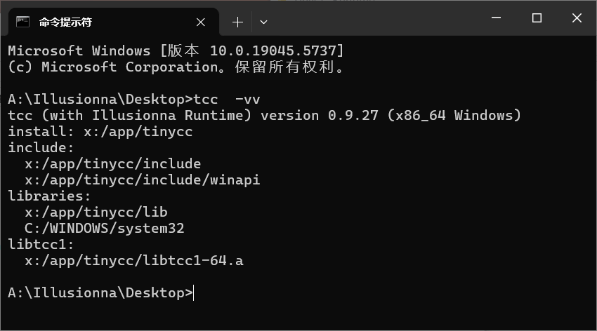

# TinyCC-Runtime

<div align=center>
    
</div>

## 指令

```bash
tcc main.c -o main.exe      // 直接生成二进制可执行文件
tcc -run main.c             // 以脚本形式运行

tcc -E main.c -o main.i     // 预处理
gcc -S main.i -o main.s     // 编译（tcc 不支持，使用 gcc）
gcc -c main.s -o main.o     // 汇编（虽然 tcc 支持，但没有 gcc 汇编的 .def 命令，继续使用 gcc）
gcc main.o -o main.exe      // 链接
```

## 修复

- 2025-04-28: `win32/include/stdlib.h` 和 `win32/include/errno.h` 头文件
```c
(x) _CRTIMP extern int *__cdecl _errno(void);   // tcc 预处理生成 main.i 语法错误.
(√) _CRTIMP int *__cdecl _errno(void);          // 不需要 extern 关键词修饰.
```

## 新特性

- 2025-04-28: 多线程 `thread.h` 头文件.
```c
// >>> tcc test-thread.c

# include <stdio.h>
# include <thread.h>
# include <windows.h>

int func(void *arg) {
    printf("thread is running...\n");
    Sleep(3000);
    printf("thread is done!\n");
    return 0;
}

int main(int argc, char *argv[], char *env[]) {
    _thread thread;
    if (create_thread(&thread, func, NULL) != thread_success) {
        printf("\x1b[31m[Error] failed to create thread.\x1b[0m\n");
        return 1;
    }
    Sleep(1000);
    printf("main is done!\n");
    return 0;
}
```
